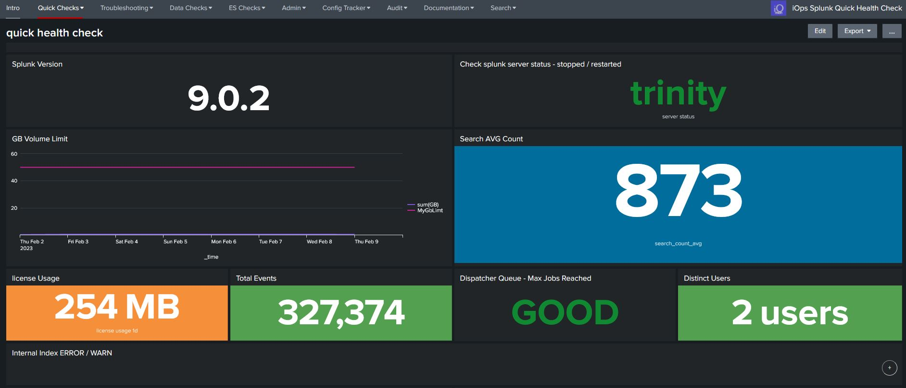

# Splunk Quick Health Check App H1

This apps provides a quick health assessment of the Splunk enviroment and some basic statistics. Its useful during Splunk delivery and where the Splunk Monitoring Console has not been factored into the solution. The app also provides a dashboard which shows all Splunk managed assets and source types.

Dashboard Features:

    Quick overview of the enviroments health
    Index and Indexer health
    Disk capacity health
    Search health
    Queues health
    Inventory
    Troubleshooting help
    ES health (Only for ES based environments)
    DMA health
    Compute health
    Internal Logs Check 
    Data Quality Checks
    Config Tracker Changes  

Dependent Apps:

Sankey - <https://splunkbase.splunk.com/app/3112/>
Nix TA - <https://splunkbase.splunk.com/app/833/>

Config:

Update the macros.conf with your indexers and search heads or if its an AIO, see macros.conf in the default, make a copy in the local folder and update

Installation Guide:

Install this on the MC OR AIO

    Download the zip and extract the file, copy the DC_splunk_quick_health to the Splunk Server
    sudo cp -R DC_splunk_quick_health /opt/splunk/etc/apps
    sudo chown -R splunk:splunk /opt/splunk/etc/apps
    sudo -u splunk /opt/splunk/bin/splunk restart

    Curl  Method
    wget  https://github.com/iopsmon/splunk_quick_health_check/archive/refs/heads/master.tar.gz
    extract the tar file into a test folder and check app, then copy to /opt/splunk/etc/apps 
